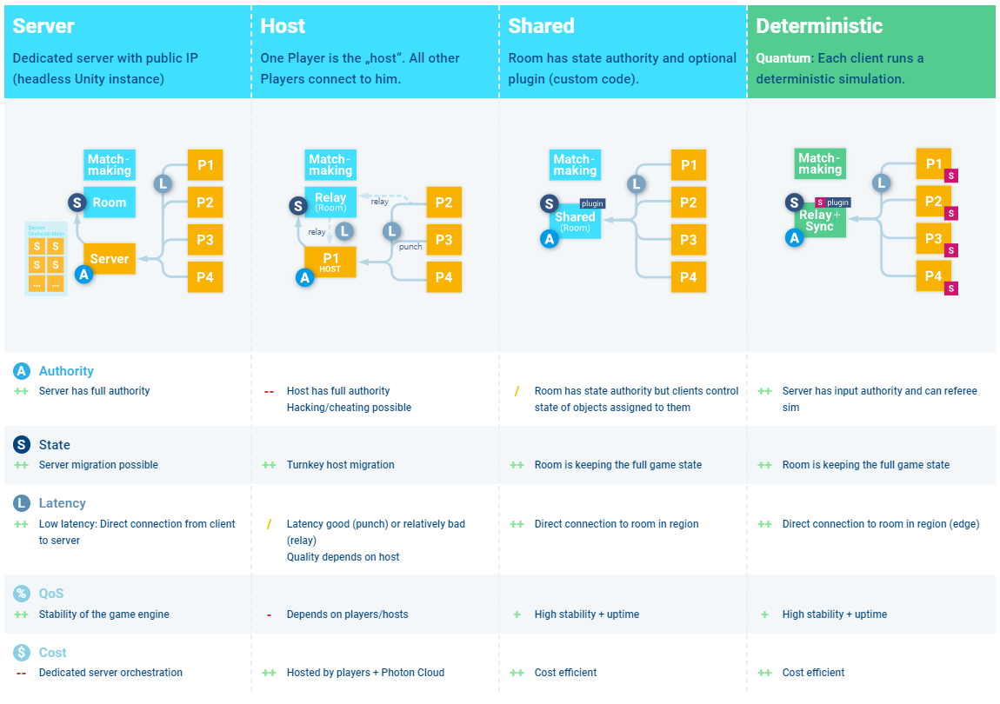

# Determinism

## Reference



## What is a Deterministic Game?

**결정론적 게임이란** 모든 클라이언트가 동일한 상태에서 동일한 입력을 처리하여 동일한 결과를 만들어내는 게임을 의미한다.

## 장점

* 네트워크로 전송되는 데이터의 양을 최소화해 서버 운영 비용 및 트래픽 비용을 줄일 수 있음
* 예측 가능한 플레이
  * 봇의 움직임, 리플레이, 테스트 시나리오 작성 용이
* 공정한 경쟁
  * 네트워크 영향을 상대적으로 덜 받아, 모든 플레이어가 같은 정보를 바탕으로 게임을 진행 가능

## 단점

* 모든 플레이어가 같은 정보를 바탕으로 게임을 진행하기 위해서 모든 플레이어의 입력을 기다려야 하므로 게임 진행이 느려질 수 있음
  * 이를 Lockstep방식이라고 부르고 다음 장에서 이를 어떻게 완화하는지 설명할 예정
* 모든 시뮬레이션 로직은 결정론적이어야 함
  * Deterministic하지 않으면 플레이어 간 동일한 상태를 유지할 수 없음

## 서버-클라이언트 구성에 따른 아키텍처 비교

<figure><figcaption>
Photon의 서비스별 아키텍처
</figcaption></figure>

위 표로 비교해보면 Deterministic이 모든 방면에서 우위를 점하는 것을 알 수 있다. 특히 Cost Efficient가 가장 큰 장점이라고 생각하는데, Act like an AI를 개발하면서 수많은 테스트를 했지만 사용한 네트워크 트래픽은 5GB 미만이었다.

결정적 게임 엔진에서 트래픽을 발생시키는 요소는 1. 상태 스냅샷, 2. 플레이어들의 인풋만이 주요 요소로 작용하기 때문이다.

## 결정론적 게임을 위한 API

크로스 플랫폼에서 결정론적 게임을 구현하기 위해서는 Unity의 Vector3, float, double 자료형 대신 Deterministic하게 구현되어 있는 Quantum API를 사용해야 하고, Pure C# 코드를 사용할 때도 결정론적으로 사용하고 있는지 주의해서 사용해야 한다.

동일한 입력에 동일한 동작을 멀티플랫폼에서 구현하기 위해 Quantum은 부동 소수점 대신 고정 소수점 자료형만을 사용한다. 부동 소수점의 오차는 허용할 수 없기 때문이다.

랜덤한 움직임 또한 클라이언트 간 동일해야 하므로 시스템의 시간을 시드로 하는 C#의 Random이 아니라 특수 자료형을 사용한다.

