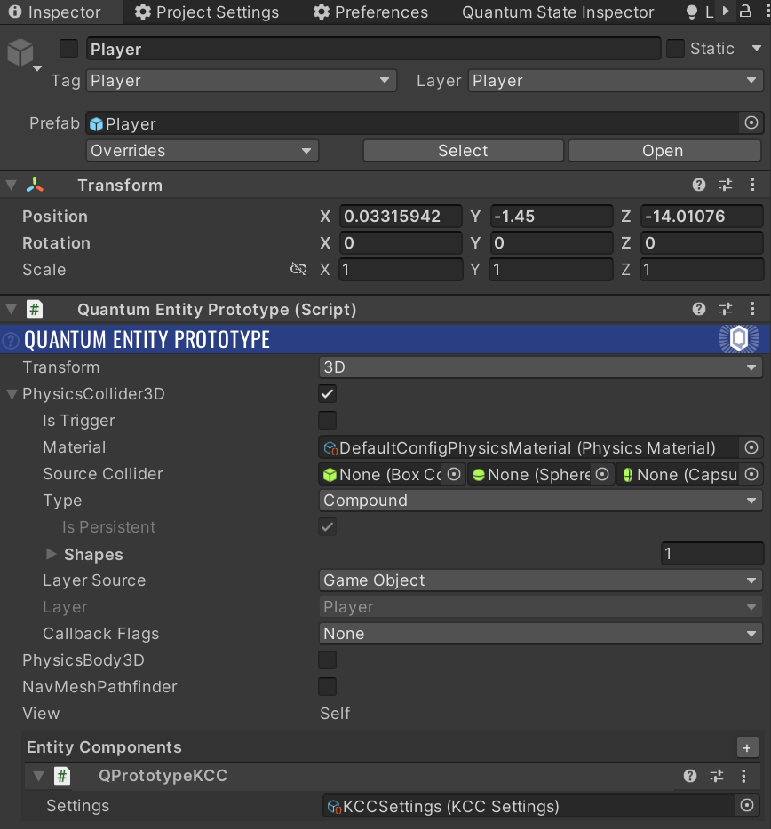
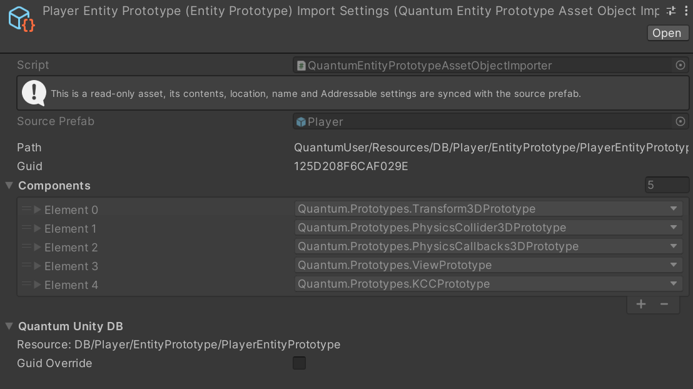
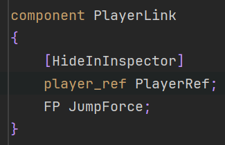

# ECS Implementation in Quantum

앞장에서 ECS에 대한 개념을 살펴보았다. 이 장에서는 Act like an AI에 사용된 Quantum ECS의 사용법을 다룬다.

Quantum ECS 구조를 사용하여 Act like an AI에서는플레이어를 어떻게 생성했는지 알아보자.

## Entity

<figure><figcaption><p>Quantum Entity Prototype</p></figcaption></figure>

<figure><figcaption><p>Quantum Entity View</p></figcaption></figure>

위는 Act like AI의 플레이어 엔티티의 구성 요소를 보여준다. 기본적으로 엔티티는 Entity Prototype과 Entity View로 이루어진다.

Entity Prototype은 엔티티 템플릿을 의미한다. 엔티티가 어떤 컴포넌트로 구성되는지에 대한 정보를 담고 있다. 여기서는 KCC(Kinematic Character Controller)를 컴포넌트로 가지고 있다.

Enitiy View는 엔티티의 시각적 표현을 담당하고, 특수한 경우가 아니면 Entity Prototype과 같은 오브젝트에 넣는다.

이 게임 오브젝트를 프리팹을 생성하듯이 Project 폴더 안에 넣으면, System에서 사용 가능한 Entity Prototype을 생성할 수 있다.

<figure><figcaption><p>프리팹 생성 시 자동으로 생성되는 Entity Prototype</p></figcaption></figure>

위 사진은 그렇게 생성된 엔티티 프로토타입이고 Components 항목을 통해서 어떠한 컴포넌트가 포함되어 있는지 알 수 있다.

## Component

<figure><figcaption><p>Component</p></figcaption></figure>

컴포넌트는 기본적으로 위와 같이 필요한 데이터를 Quantum의 자료형으로 선언한다. Quantum DSL로 컴포넌트를 선언하면 Quantum이 내부적으로 필요한 코드를 작성해준다.

#### 예외

: ECS 구조에서는 컴포넌트에 게임 로직을 부여하지 않는 것이 원칙이지만, Quantum은 예측 / 롤백을 위해서 중요 컴포넌트에는 게임 로직을 넣는 것을 허용한다.

ECS에서의 System은 Rollbackable 해야 해서 stateless해야 하는데(같은 입력에 같은 아웃풋을 생산해내야 하기 때문), 예측 / 롤백을 위해서는 프레임의 정보를 직렬화해 스냅샷처럼 저장해야 한다. 이를 위해 추가적인 로직을 구현하는 것보다 ECS를 변형하는 것이 낫다고 판단한 것으로 추측한다.

실제로 Act like an AI 개발에 사용한 KCC(Kinematic Character Controller)같은 핵심 컴포넌트에는 Update(), Teleport(), Attack() 등 많은 메서드가 포함된다.

## System

System에서는 게임 로직을 실행한다. 앞서 설명했듯이 크로스 플랫폼에서 결정적이어야 하기 때문에 특수 자료형을 사용하고, 같은 인풋에 같은 아웃풋이 나올 수 있게 Stateless상태를 유지해야 한다. Stateless라는 것은 멤버 변수를 선언하지 않는다는 뜻이다.

### How to Instantiate Entity with Necessary Components

엔티티 프로토타입을 만들었다면, System에서 엔티티를 생성해 씬에 나타낼 수 있다. 다음은 Act like an AI에서 Entity Prototype을 통해 플레이어를 생성한 코드이다.

```csharp
public void OnGameStarting(Frame frame)
{
    // 전역 변수로 전체 플레이어 리스트를 관리하므로 모든 시스템에서 사용할 수 있다.
    var playerRefList = frame.ResolveList(frame.Global->PlayerRefList);
    
    // 플레이어, AI(플레이어가 적을 경우 사용), Minion의 수를 관리
    frame.Global->StartedPlayersCount = frame.Global->PlayersCount;
    frame.Global->AIPlayersCount = 0;
    frame.Global->MinionPlayersCount = 0;
    
    List<(int x, int z)> spawnPositions = new List<(int x, int z)>();
    int min = MINIMUM_POSITION;
    int max = MAXIMUM_POSITION;
    
    // 연결된 플레이어의 수 만큼 플레이어 엔티티를 생성하고 남은 수는 AI로 채움
    // 기본 설정 : 플레이어의 수 + AI의 수 = 10
    foreach (var player in playerRefList)
    {
        SpawnPlayer(frame, player,spawnPositions, min, max);
    }
    FillWithAI(frame, spawnPositions, min, max);
    // MAX_MINION_COUNT만큼 미니언 엔티티 생성
    for (int i = 0; i < MAX_MINION_COUNT; i++)
    {
        SpawnMinion(frame, spawnPositions, min, max);
    }
}

private void SpawnPlayer(Frame frame, PlayerRef player, List<(int x, int z)> spawnPositions, int min, int max)
{
    // EntityPrototype 가져오기
    var playerAvatarAssetRef = frame.RuntimeConfig.DefaultPlayerAvatar;
    EntityPrototype playerPrototypeAsset = frame.FindAsset(playerAvatarAssetRef);
    EntityRef playerEntity = frame.Create(playerPrototypeAsset);
    
    // 플레이어 정보 관리
    var playerLink = new PlayerLink()
    {
        PlayerRef = player,
        JumpForce = FP.FromFloat_UNSAFE(5.5f)
    };
    // 프레임에 add해야 프레임이 이 정보를 읽을 수 있다.
    frame.Add(playerEntity, playerLink);
    
    // 난수 시드 생성
    int rngSeed = unchecked((frame.Number ^ player) % int.MaxValue);
    RNGSession rngSession = new RNGSession(rngSeed);
    
    // Spawn Point 지정
    int randomX = rngSession.Next(min, max);
    int randomZ = rngSession.Next(min, max);
    (int x, int z) spawnPosition = (randomX, randomZ);
    FPVector3 spawnVector;
   
    // Spawn Point가 겹치치 않도록, 필요 시 시드 변경
    while (true)
    {
        if (spawnPositions.Contains(spawnPosition))
        {
            rngSeed++;
            rngSession = new RNGSession(rngSeed);
            randomX = rngSession.Next(min, max);
            randomZ = rngSession.Next(min, max);
            spawnPosition = (randomX, randomZ);
        }
        else
        {
            spawnVector = new FPVector3( spawnPosition.x, 0, spawnPosition.z);
            spawnPositions.Add(spawnPosition);
            break;
        }
    }
    
    // 플레이어를 랜덤한 위치에 랜덤한 각도로 스폰
    Transform3D* transform = frame.Unsafe.GetPointer<Transform3D>(playerEntity);
    FP randomYaw = FP.FromFloat_UNSAFE(rngSession.Next(-180, 180)); 
    transform->Position = spawnVector;
    transform->Rotation = FPQuaternion.Euler(FP._0, randomYaw, FP._0);
    transform->Teleport(frame, transform);
}
```

### How to Destroy Entity

System에서 KCC를 필터링하고 KCC를 컴포넌트로 가진 엔티티를 제거할 수 있다.

```csharp
public void OnDespawnPlayers(Frame frame)
{
    var filtered = frame.Filter<KCC>();

    while (filtered.Next(out var entity, out var character)) {
        frame.Destroy(entity);
    }
}
```
