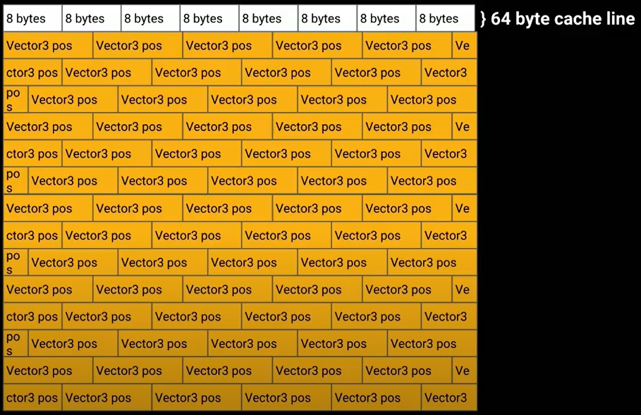
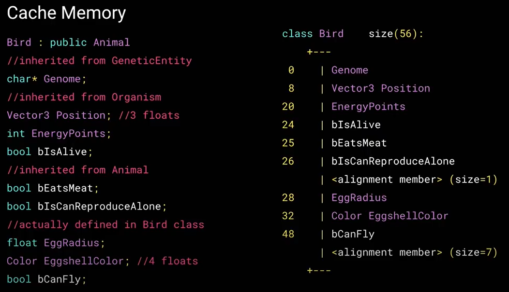
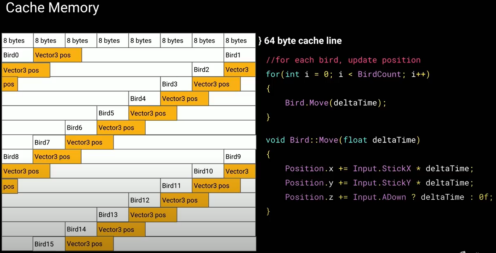

# ECS in High Level

Photon Quantum 3라는 프레임워크가 어떻게 동작하는지 이해하려면 먼저 ECS라는 디자인 패턴에 대한 이해가 필요하다.&#x20;


Understanding ECS Session by Unity Technologies



ECS Overview in 7 minutes


## What is ECS?

ECS는 컴퓨팅 기기의 High-Performance를 위해서 메모리 영역의 캐시 메모리 효율성을 높이기 위해 고안된 디자인 패턴이다. 게임 엔진의 역할을 GPU를 주로 사용하는 View와 CPU를 주로 사용하는 Simulation의 영역으로 나눴을 때, Simulation 영역에 적용 가능한 디자인 패턴에 해당한다.

<figure><figcaption>
Photon Quantum3의 구조
</figcaption></figure>

## Why do we need ECS?

컴퓨터에서 많은 연산은 Spatial Locality나 Temporal Locality의 성질을 가진다. Spatial Locality는 가까운 메모리 주소들이 연속적으로 접근되는 경향을 말하며, Temporal Locality는 동일한 메모리 주소가 짧은 시간 안에 반복적으로 접근되는 경향을 말한다.

또한 캐시 메모리에서 CPU 레지스터로 데이터를 적재하는 시간은 매우 짧다. 그러나 메인 메모리에서 CPU 레지스터로 데이터를 적재하는 시간은 그에 비해 길다. 따라서 캐시 메모리의 효율성을 높인다면 자연스럽게 컴퓨팅 기기의 성능도 높일 수 있을 것이다.

물론 C#과 같은 고급 언어에서는 개발자가 명시적으로 **메인 메모리**와 **캐시**에 데이터를 적재하도록 지정할 수 있는 기능은 제공되지 않는다. **캐시** 관리와 관련된 작업은 대부분 하드웨어 및 운영체제 수준에서 자동으로 이루어진다. 그러나 개발자는 **메모리 레이아웃을 최적화**하여 **CPU 캐시 효율성**을 높일 수 있는 방법을 사용할 수 있다.

ECS는 이 원리를 기반으로 한다. 유니티를 실행하는 클라이언트의 컴퓨팅 기기에서 최대한 많은 데이터를 그 기기의 캐시 메모리에 넣어둘 수 있다면 자연스럽게 더 빠르게 시뮬레이션을 실행할 수 있을 것이다.

캐시 메모리에 데이터가 들어갈 수 있는 정도를 사용률이라고 말하겠다. 이 캐시 메모리 사용률을 높이기 위해서는 한정된 공간의 캐시 메모리에 데이터를 최대한 빈틈 없이 채워 넣으면 된다. 아래는 64바이트의 캐시 라인을 가지는 캐시 메모리에 12바이트의 벡터를 빈틈 없이 차곡차곡 채워 넣은 모습이다.

<figure><figcaption>
ECS에서 추구하는 캐시 구조
</figcaption></figure>

이렇게 캐시에 빈틈 없이 데이터를 채워넣으려면 클래스를 사용하는 OOP로는 한계가 있다. 아래와 같은 자료 구조를 가진 클래스가 있다고 할 때,

<figure><figcaption>
OOP에서 사용하는 자료구조
</figcaption></figure>

캐시 메모리는 아래와 같이 사용되고 각 클래스 인스턴스마다 절반 이상의 공간이 사용되지 않음에도 공간을 차지해 캐시 메모리 공간을 낭비하게 된다.

<figure><figcaption>
OOP에서 자주 보이는캐시 구조
</figcaption></figure>

## ECS의 특징

* **메모리 레이아웃 최적화** : 필요한 컴포넌트만 순차적으로 접근하기 때문에 메모리 사용을 최적화할 수 있음
  * 구체적으로, 엔티티가 특정 컴포넌트를 가질 때만 메모리를 할당하므로, 불필요한 메모리 사용을 줄일 수 있음. 필요한 데이터만 메모리에 연속적으로 배치함.
  * 예를 들어, 게임에 100개의 엔티티가 있고, 이 중 30개의 엔티티만 "Position" 컴포넌트를 필요로 한다면, 나머지 70개의 엔티티는 "Position" 컴포넌트와 관련된 메모리를 차지하지 않으며, 오직 30개의 엔티티에 "Position" 컴포넌트를 추가하는 시점에만 해당 엔티티들에 대해 메모리가 할당됨
* **캐시 친화적** : 각 컴포넌트가 메모리 상에서 연속적으로 저장되기 때문에 CPU가 캐시 지역성을 최대한활용할 수 있음

## ECS의 요소

### Entity

ECS에서 엔티티는 다른 컴포넌트들을 조합하는 동시에 식별자 역할을 한다.

기본적으로 Entity라 함은 OOP에서 사용하던 Object의 개념과 비슷해보일 수 있지만 전혀 다른 개념이다. Entity는 컴포넌트를 참조하기 위한 인덱스이다.

Entity는 단지 컴포넌트를 참조하는 인덱스이므로, 메서드와 멤버 변수가 결합된 클래스와 달리, 게임 로직은 System에서 작성하게 되는데, System에서 Entity를 사용하려고 할 때 ECS 구조에서 엔티티를 불러올 방법이 필요하다. 이때 사용하는 것이 엔티티이다. 시스템에서 특정 엔티티를 가져오려면 모든 엔티티를 대상으로 엔티티가 가진 컴포넌트를 필터링하는 방법을 사용해야 한다.

### Component

쉽게 말하면 OOP에서 클래스에 정의하던 필드의 역할을 ECS의 컴포넌트에서 맡는다고 볼 수 있다. 또한 컴포넌트에는 게임 로직은 최대한 배제하고, 데이터만 담아야 한다.

컴포넌트 작성 시 가장 중요한 것은 컴포넌트를 컴팩트하게 설계해야 한다는 것이다. 클래스에서 사용하던 불필요한 필드 때문에 캐시 메모리가 낭비되어 ECS가 고안된 것이므로 컴포넌트 작성 시 반드시 필요한 자료형들만 선언해야 한다.

ECS 구조가 캐시 메모리 효율성을 높이기 위해서 고안되었는데, OOP에서 ECS로 마이그레이션한다고 할 때 기존 클래스에 있던 필드들을 한 컴포넌트에 모두 옮겨 적으면 ECS를 가진 장점을 잃게 된다. 따라서 적절히 컴포넌트를 세분화 해야 한다.

### System

시스템은 게임 로직을 담당한다. 시스템에서 엔티티가 가진 컴포넌트들을 조작해 Output을 만든다. 시스템은 엔티티를 컴포넌트를 필터링하는 형식으로 Get하는데, 이렇게 필터링하면 해당 컴포넌트를 가진 엔티티에서 해당 로직을 런타임에 실행할 수 있다.

여기까지 ECS에 대한 개념을 살펴보았다. 실제 ECS의 구현은 더 복잡하므로, 양질의 ECS를 사용하려면 오픈소스나 프레임워크를 사용하는 것이 좋다.

## **세부 구현 참고(Sparse Sets)**


