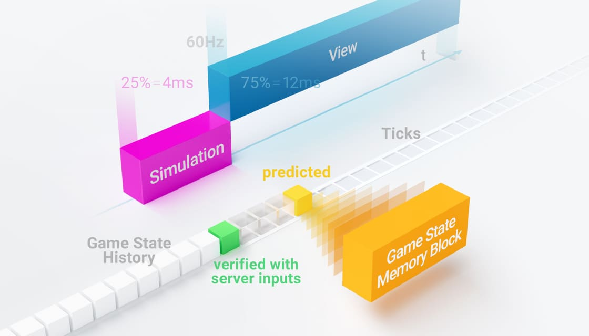
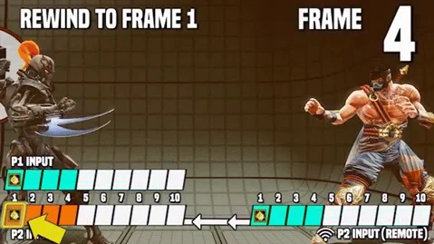

# Lockstep and Prediction/Rollback

## Reference





## Lockstep

Lockstep은 멀티플레이어 게임에서 사용되는 동기화 방식으로, 모든 클라이언트가 동일한 상태에서 게임을 진행하도록 보장하는 시스템이다. Lockstep에서는 모든 플레이어가 같은 게임 프레임에서 동일한 입력을 받아야만 다음 프레임으로 넘어갈 수 있다.

작동 방식:

1. 각 클라이언트는 자신의 입력을 서버나 다른 클라이언트에게 보낸다.
2. 모든 플레이어의 입력이 모일 때까지 기다린다.
3. 모든 입력이 모이면 각 클라이언트는 그 입력을 바탕으로 같은 계산을 수행하고, 게임을 동일하게 진행힌다.

이 방식의 장점은 결정론적(Deterministic)인 게임 상태를 유지할 수 있다는 것이다. 즉, 모든 플레이어가 같은 입력을 받으면 각자의 게임 환경에서도 동일한 결과가 나오므로, 게임 상태가 항상 동기화된다는 것이다.

하지만 단점으로는 네트워크 지연(Latency)에 민감해서, 한 명이라도 늦게 응답하면 모든 플레이어가 기다려야 한다는 점이 있다.

만약 모든 플레이어의 인풋을 받기 전에 클라이언트가 상태를 주기적으로 업데이트하는 방식을 사용할수는 없을까? 라고 생각할 수 있는데 주기적 업데이트를 사용하면 다음과 같은 상황이 생길 수 있다.

## 주기적 업데이트의 예시: 두 플레이어의 상호작용

1. **게임 환경 설정**:
   * **플레이어 A**와 **플레이어 B**가 같은 맵에서 게임을 하고 있다.
   * 두 플레이어는 각각 독립적인 클라이언트를 사용하고 있다.
2. **상태 업데이트 과정**:
   * 두 플레이어는 한 틱에서 각각 다음과 같은 입력을 보낸다:
     * **플레이어 A**: "앞으로 이동하고 공격하기"
     * **플레이어 B**: "뒤로 이동하고 회피하기"
   * 클라이언트가 **주기적으로 업데이트**하도록 설정되어 있다고 가정한다.
3. **틱 타이밍**:
   * 틱 시간이 100ms로 설정되어 있고, 입력이 50ms에 이루어질 때:
     * **50ms** 후, 플레이어 A는 자신의 클라이언트에서 이동 및 공격을 수행한다.
     * 같은 시점에서, 플레이어 B는 뒤로 이동하고 회피를 한다.
4. **상태 불일치 발생**:
   * 만약 네트워크 지연으로 인해서 플레이어 A의 클라이언트가 **50ms 후**에 플레이어 B의 입력을 수신하지 못한다면, A는 B의 동작을 인지하지 못한 상태에서 자신의 행동을 처리한다.
   * 이제 플레이어 A는 공격을 시도하지만, 플레이어 B는 이미 뒤로 이동하여 회피한 상태이므로 플레이어 A의 공격이 **B에게 닿지 않는다**.
   * A는 공격이 성공했다고 생각하지만, B는 공격을 피했다고 생각한다. 이로 인해 두 클라이언트에서의 게임 상태가 다르게 된다.

#### 결과:

* **플레이어 A**: "내 공격이 성공했어!"
* **플레이어 B**: "난 공격을 피했어!"

이처럼 각 클라이언트가 서로 다른 시점에서 업데이트가 이루어지면, 같은 입력을 기반으로 하더라도 게임 상태가 다르게 처리될 수 있다.

이를 막으려면 앞서 말했듯이 클라이언트는 모든 플레이어의 인풋을 받을 때까지 기다려야 한다. 그래서 **네트워크 상태가 나쁜 플레이어** 때문에 전체 게임의 틱 진행이 지연될 수 있다. 이로 인해, 네트워크 상태가 좋은 플레이어도 나쁜 플레이어의 지연으로 인해 게임이 느려지거나 끊기는 현상을 겪을 수 있다. 플레이어의 수가 늘어날수록 네트워크 지연이 생길 확률이 커지는 건 덤이다.

## Prediction / Rollback

이 lockstep 방식을 개선한 것이 예측과 롤백 방식이다. 이 방식에서 클라이언트는 모든 플레이어의 인풋을 기다릴 필요 없이, 클라이언트가 자체적으로 인풋을 예측하고 로컬 시뮬레이션을 실행한다. 만약 예측된 입력이 잘못되었을 경우, 서버가 올바른 입력을 전달받은 후에 클라이언트는 게임 상태를 롤백하여 그 시점부터 정확한 상태로 다시 시뮬레이션한다.

이 예측 / 롤백이 필요한 이유는 다음과 같다.

* 위에서 설명한 Strict Lockstep 방식에서는 모든 플레이어를 기다려야 하므로 위험부담이 있다. 만약 한 플레이어의 입력이 계속 늦어지는데 그 플레이어는 사실 아무것도 입력하지 않은 상태여서 입력 업데이트를 할 필요가 없는 상황이라면? 기다릴 필요가 없는데도 불구하고, Lockstep 때문에 기다려야 한다.
* 이런 이유로 Strict Lockstep방식 대신 모든 플레이어를 기다리지 않고 주기적으로 업데이트하는 방식을 사용하면 근소한 네트워크 지연으로도 클라이언트 간의 상태가 다를 수 있다는 단점이 있다.
* 이 사소한 차이로 인한 ‘클라이언트 간 상태 불일치’를 막기 위해 예측 / 롤백을 사용한다. 특히 무선 통신을 사용하는 모바일에서는 네트워크가 더 불안정해 패킷 손실이 많아 사소한 차이가 많이 생길 수 있는 환경인데, 이를 효과적으로 케어한다.

예측 / 롤백 구조

<figure><figcaption>
Quantum의 예측/롤백 구조
</figcaption></figure>

**정리하면 예측 / 롤백 방식은 네트워크 상태가 나쁜 클라이언트의 입력이 늦게 도착하더라도, 클라이언트는 전체 게임을 지연시키지 않고 프레임 예측으로 원활하게 플레이할 수 있도록 돕고, 롤백으로 클라이언트 간의 상태를 동일하게 유지할 수 있게 한다.**

## Quantum에서의 구현 방식

Quantum에서 플레이어의 마지막 입력은 예측 프레임 동안 반복된다. 로컬 시뮬레이션은 이러한 예측을 기반으로 진행된다. 그러나 주의해야 할 점이 있다. 다음 그림을 보자.

예측 / 롤백은 캐릭터의 가속 / 감속이 없는 형태로 보면 아래와 같이 보이며, 맨 아래에 있는 플레이어의 포지션 롤백이 눈에 뜨게 보인다.

위 현상은 가속 / 감속이 있으면 예측값과 롤백값이 중간에서 만나 절충되지만, 가속 / 감속이 없으면 예측값과 롤백값이 절충이 되지 않아 차이가 크게 보이기 때문에 나타난 현상이다.

따라서 예측 / 롤백은 가속 / 감속을 필요로 하고, 부자연스러워 보일 수 있으므로 게임에 따라 그 정도가 중요한데 Quantum에서는 예측 / 롤백 시스템이 이미 구현된 상태로 세부 사항을 커스텀할 수 있다.

아래는 Quantum에서의 예측 / 롤백 설정 에셋이다.

<figure><figcaption>
예측 / 롤백 설정 에셋
</figcaption></figure>

### 주요 옵션

* Simulation Rate
  * 1초에 몇 번의 틱이 발생하는지
* Force Strict Lockstep
  * 예측 / 롤백 방식이 아닌 기존 Lockstep 방식을 사용할 것인지
  * Lockstep방식을 사용하면 당연히 아래의 예측 / 롤백을 위한 옵션은 필요가 없음
* Rollback Window
  * 로컬 링버퍼에 유지할 프레임의 수, Prediction Frame을 몇 프레임까지 예측할 것인지
  * 링버퍼를 사용하는 이유는 FIFO구조를 사용하고, 가득 차면 가장 오래된 데이터를 자동으로 덮어쓰므로, 최신 상태를 유지하면서도 과거 상태를 일정하게 보존할 수 있기 때문
* Input Delta Compression
  * 인풋 자체가 아닌 변화값만 전달할 것인지
  * 이 옵션을 사용하면 변화가 없을 때는 전달할 내용이 없기 때문에 Network Bandwidth가 줄어듦
* Input Offset Min, Max
  * 입력 지연을 추가하여 잦은 롤백을 완화할 수 있음
  * Input Offset Min은 입력 지연을 통해 Prediction Frame의 수를 줄이므로, Misprediction 또한 줄일 수 있는 효과를 가지나, 말 그대로 입력에 대한 지연 시간이 발생하는 것이므로 주의해서 사용해야 함

## 입력 지연(Input Offset)

<figure><figcaption>
3프레임의 입력 지연 적용
</figcaption></figure>

입력 지연과 Prediction / Rollback은 같이 사용하면 좋은 옵션이다. 멀티플레이어 환경에서는 상대 플레이어에게 데이터 전송을 하려면 네트워크를 통해야 하므로 항상 몇 프레임 정도 후에 도착할 수 밖에 없기 떄문이다.

입력 지연을 통해서 인풋이 발생한 후 의도적으로 로컬 플레이어와 remote 플레이어 모두에게 인풋이 적용될 프레임을 딜레이시키면, 로컬 플레이어와 remote 플레이어가 이론적으로는 동일한 프레임에서 인풋을 적용하기 때문에 이상적인 격투 게임을 구현할 수 있다.

<figure><figcaption>
입력 지연을 적용하지 않을 경우 롤백 발생
</figcaption></figure>

또한 입력 지연이 없다면 현실적으로 롤백이 자주 발생하기 때문에 몇 프레임 정도 있는 것이 필수적이다. 위 그림은 P1의 Input으로는 4프레임까지 실행했는데, 네트워크 딜레이(핑에 따라 다름) 때문에 P2의 인풋이 늦게 도착해 예측 프레임을 실행한 것을 보여준다(주황색 칸은 Verified Frame이 아님). 이 상황이 자주 발생해 롤백이 잦기 때문에 입력 지연을 추가해야 한다.

Act like an AI에서는 테스트 결과 10 frames의 Input Offset을 적용했는데, 다소 반응이 느릴 수 있다고 생각될 수 있지만, 장르가 캐주얼 게임에 가깝고 입력 지연을 육안상으로 구분할 수 없다고 생각했기에 그렇게 적용했다. 또한 10 frames 이하에서는 롤백이 생각보다 자주 발생했기 때문이기도 했다.

## 결론

위 내용이 이론적으로 쉽게 보일지도 모르지만, Prediction/Rollback은 고려 해야할 점이 많고, 구현 자체도 상당히 어렵다.&#x20;

그러나 Quantum은 이러한 복잡성을 개발자로부터 숨겨준다. Quantum에서 내부적으로 처리하기 때문이다. 이는 Quantum의 큰 장점 중 하나이다.
