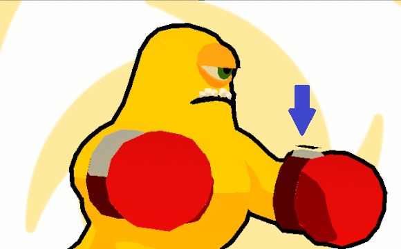

# Scriptable Render Pipeline과 Outline

## Reference





## Outline

개인적으로 캐주얼 게임에서 캐릭터를 돋보이게 만드는 것은 캐릭터의 아웃라인이라고 생각한다. 이 아웃라인이 상대적으로 캐릭터를 깔끔하고, 카툰스럽게 만들어준다.

다음은 상용 게임에서의 아웃라인 예제이다.

<figure><figcaption>
브롤스타즈의 프랭크
</figcaption></figure>

<figure><figcaption>
스쿼드 버스터즈의 스쿼드
</figcaption></figure>

<figure><figcaption>
원신의 카에데하라 카즈하
</figcaption></figure>

원신에서는 Color, Normal, Depth 정보를 사용하여 Edge Detection 쉐이더를 작성해 Mesh의 경계 부분에 아웃라인을 그렸다.

스쿼드 버스터즈에서는 겹치는 Mesh를 하나로 취급하여 그 가장자리에만 Outline을 렌더링했다.

Act like an AI에서는 카메라 확대 기능을 제공하지 않기 때문에 굳이 원신처럼 디테일한 아웃라인을 그릴 필요가 없어서 더 캐주얼한 모습을 강조할 수 있도록, 스쿼드 버스터즈처럼 캐릭터의 가장자리에만 Outline을 렌더링하는 방법을 택했다.

## SRP(Scriptable Render Pipeline)의 장점

캐릭터의 가장자리에 아웃라인을 그리려면 쉐이더를 작성하거나 에셋을 사용하여 렌더링할 수도 있지만 SRP를 사용하면 다음과 같은 장점이 있다.

#### 1. 불필요한 렌더링 최소화

* SRP를 사용하면 불필요한 객체에 대한 아웃라인 렌더링을 피할 수 있다. 예를 들어, 특정 레이어의 객체만 아웃라인을 그리는 렌더 오브젝트를 정의할 수 있다.

#### 2. 렌더링 순서의 명확한 관리

* SRP에서는 GUI로 제공되는 Event를 통해 각 객체의 렌더링 순서를 명확하게 관리할 수 있어, 아웃라인이 언제 어떻게 그려질지 정확히 제어할 수 있다. 예를 들어, 실제 객체를 그리기 전에 아웃라인 객체를 먼저 그린 후 실제 객체를 그리도록 할 수 있다.
* 커스텀 셰이더에서는 렌더링 순서를 제어하는 것이 SRP에 비해 복잡하고 덜 직관적일 수 있다.

#### 3. 구조적으로 생산성 강화

* 쉐이더로만 아웃라인을 그리면 다른 쉐이더를 쓰는, 아웃라인이 필요한 객체가 생길 때마다 아웃라인을 적용하기 위해 그 쉐이더를 수정해야 하는데 이 번거로움을 없앨 수 있다.
* 쉐이더나 Material의 변경이 필요해도 하나의 소스만 바꾸면 된다.

## SRP의 활용

### Render Objects

이제 Act like an AI에서 사용된 Outline은 어떻게 구현했는지 알아보자.

먼저 사용중인 ‘Universal Render Pipeline Asset > Universal Renderer Data’의 Renderer Features에서 두 개의 Render Objects를 정의해야 한다.

<figure><figcaption>
Render Objects
</figcaption></figure>

위 두 개의 Render Object의 의미는 위에서부터 순서대로 다음과 같다.

1. AfterRenderingTransparents 시점에 OutlineMaterial을 이용하여 Player, Enemy 레이어의 객체를 렌더링한다. (아웃라인 바탕을 그리는 과정)
2. BeforeRenderingPostProcessing 시점에 객체 자체의 Material을 이용하여 Player, Enemy 레이어의 객체를 렌더링한다. (실제 객체를 그리는 과정에 해당함)

또한 두 오브젝트 모두 Player와 Enemy Layer의 오브젝트에만 적용하도록 Layer Mask를 설정했다.

첫 번째 Render Object에서 Outline을 렌더링할 때에는 Depth를 켜고 Depth Test는 Less Equal로 했는데, 그 이유는 **카메라에서 더 가까운 객체의 뒤쪽**으로는 그려지지 않게 하기 위함이다. 객체 별로 각자의 아웃라인을 가지고 있어야 하기 때문에 Depth체크가 필수적이다.

두 번째 Render Object에서는 이미 Outline을 그린 이후라 객체 자체는 Depth에 상관 없이 그려도 상관없으므로 Depth 체크를 해제한다. (Depth를 체크해도 결과는 같다.)

<figure><figcaption>
RenderObjects를 사용한 아웃라인 렌더링 단계 예시
</figcaption></figure>

### Outline Material

다음으로는 첫번째 Render Object에서 사용할 Outline을 위한 Material을 작성해야 한다. Material에 사용할 쉐이더는 쉐이더 그래프를 통해 작성할 것이다. 다음은 노드의 순서 설명이다.

1. 로컬 좌표계에서 물체의 Normal Cector를 가져온다.
2. Normal Vector를 단위 벡터로 Normalize한다.
3. 단위 벡터에 Outline Thickness를 곱해서 두께를 조절한다.
4. 위 벡터에 로컬 좌표계의 Position Vector를 더해서 Vertex Shader의 Position으로 전달한다.
5. Fragment Shader에서는 Outline Color를 전달받아 최종 Outline의 색깔을 결정한다.

<figure><figcaption>
Outline Shader Graph
</figcaption></figure>

이렇게 작성한 쉐이더 그래프를 OutlineMaterial에서 Shader로 사용하면 모든 단계가 완료된다.

<figure><figcaption>
Outline Material
</figcaption></figure>

## 비교

<figure><figcaption>
아웃라인이 없을 때
</figcaption></figure>

<figure><figcaption>
아웃라인이 존재할 때
</figcaption></figure>

아웃라인이 있을 때가 확실히 카툰 느낌이 있어 전달력이 있어보인다.

## 주의

Outline Shader Graph는 Mesh의 Normal을 사용하기 때문에 모델은 항상 Good Topology을 유지해야 한다. 예를 들어 아래 글러브에서는 손목 부분의 회색 Mesh는 Bad Topology를 가지고 있다. 왜냐하면 Mesh를 매끄럽게 조합한 것이 아니라, 그냥 단순히 글러브 위에 Mesh를 붙였기 때문이다.

<figure><figcaption>
Bad Topology를 가진 글러브
</figcaption></figure>

Bad topology를 가진 메쉬가 Normal Vector를 조작하는 셰이더와 결합될 경우, 화살표에서 보이는 바와 같이 렌더링할 때 의도하지 않은 결과로 이어진다.

<figure><figcaption>
Bad Topology의 예시
</figcaption></figure>
