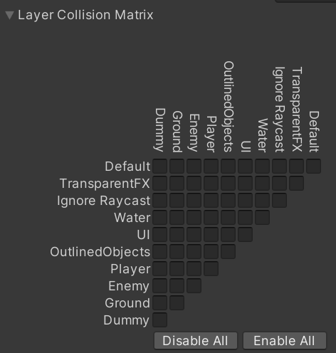

# 모바일 최적화 체크 리스트

## Reference

{% embed url="https://ijemin.com/blog/%EC%9C%A0%EB%8B%88%ED%8B%B0-2d-%EA%B2%8C%EC%9E%84-%EB%B9%8C%EB%93%9C-%EC%B5%9C%EC%A0%81%ED%99%94-%ED%8C%81/" %}

## 기본 프레임 설정

* Application.targetFrameRate 를 60으로 설정
  * 모바일에서는 30이 기본으로 설정되어 있음

## 코딩 스타일

* Start(), Update() 같은 함수는 어차피 런타임에 호출되기에 비어있다면 지울 것
* GameObject.Find() 사용 지양
* string 대신 StringBuilder 나 String.Format() 을 사용할 것
* Debug.Log() 최소화

## Scene 디자인 스타일

* 사용하지 않는 게임 오브젝트는 미리 비활성화 할 것
  * 오브젝트를 실시간으로 파괴하는 것보다, 비활성화 하는게 비용이 저렴

## Quality

* Quality - vSync Count : Every V Blank
  * 몇몇 기기에서는 60fps 이상 렌더링할 수 있는데, 기기가 과열되는 것을 막아줌
    * Application.targetFrameRate가 60이면 그 이상 렌더링하지 않지만 안전장치로 사용
* Texture Quality를 가능한 낮게 잡을 것
  * Global Mipmap Limit : Half Resolution 으로 설정

## Audio

| 종류                 | 효과음                    | 배경음악                   |
| ------------------ | ---------------------- | ---------------------- |
| Load Type          | **Decompress On Load** | **Compress On Memory** |
| Compression Format | ADPCM                  | Vorbis                 |

## 폰트

* 한국어는 Fall Back Asset 으로 지원

## 물리

* 이 게임에서는 물리가 시뮬레이션 레벨에서 사용되므로, View 레벨의 유니티의 물리는 필요가 없음. 따라서 불필요한 계산을 하지 않기 위해 Layer Collision Matrix를 전부 체크해제

<figure><figcaption></figcaption></figure>
