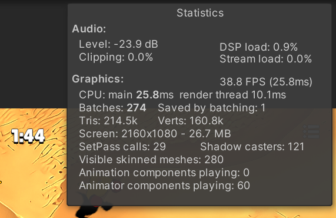

# URP와 Batch

## Reference


URP와 Batching


## URP(Universal Render Pipeline)

URP(Universal Render Pipeline)는 Unity에서 제공하는 경량화된 렌더링 파이프라인으로, 다양한 플랫폼에서 최적화된 그래픽 렌더링을 가능하게 한다. URP는 모듈화된 구조로 구성되어 있어 개발자가 필요한 기능을 선택적으로 사용할 수 있으며, 모바일 등 성능이 제한된 환경에서도 높은 성능을 유지할 수 있게 하는 것을 목적으로 만들어졌다.

#### 렌더링 파이프라인의 개념

렌더링 파이프라인은 3D 씬을 화면에 표시하기 위한 일련의 단계를 정의하는 시스템이다. 그 과정을 매우 간단히 축약하면 다음과 같은 단계로 구성된다

1. **입력 처리**: 씬의 데이터(모델, 텍스처 등)를 불러오는 단계
2. **조명 계산**: 씬의 조명 효과를 적용하는 단계
3. **셰이더 적용**: 각 픽셀에 색상을 결정하는 계산을 수행하는 단계
4. **출력**: 최종 이미지로 렌더링하여 화면에 표시하는 단계

## Batch

렌더링에서 Batch는 **한 번에 여러 개의 드로우 콜을 묶어서 처리**하는 과정을 의미한다. 그래픽스 프로세싱에서는 드로우 콜(Draw Call)이라는 개념이 중요한데, 이는 CPU가 GPU에 특정한 그래픽 오브젝트를 렌더링하라고 요청하는 명령이다. 배치는 이러한 드로우 콜을 줄여 **성능을 최적화**하는 중요한 기법 중 하나이다.

#### **Batch의 의미**

배치란 **유사한 렌더링 작업들을 그룹화하여** 한 번의 드로우 콜로 처리하는 것을 의미한다. 예를 들어, 같은 셰이더를 사용하는 여러 오브젝트가 있다면, 이들을 개별적으로 렌더링하는 대신 한 번에 묶어서 렌더링하면 **CPU와 GPU 간의 통신 비용을 줄일 수 있다.**

드로우 콜을 줄이는 이유는, 각 드로우 콜마다 **CPU가 GPU에 명령을 보내는 오버헤드**가 존재하기 때문이다. 이런 오버헤드는 게임이나 애플리케이션이 실시간으로 렌더링할 때 큰 성능 저하를 일으킬 수 있다. 배치를 통해 이러한 오버헤드를 줄이면 **프레임률**이 개선되고 **그래픽 성능**이 향상된다.

#### **Batching의 종류**

Unity URP에서는 주로 다음과 같은 배칭 기법을 사용한다.

1. **Static Batching**
   * 움직이지 않는 정적 오브젝트들을 배치하는 방법
   * 정적 배칭은 움직이지 않는 오브젝트들을 미리 묶어서, 한 번에 렌더링할 수 있도록 함. 예를 들어, 건물이나 지형처럼 움직이지 않는 오브젝트들을 배치하여 성능을 개선함
   * 이 방식은 미리 배치된 오브젝트들을 메모리에 저장하고, 필요할 때 빠르게 한꺼번에 렌더링함
   * Static Batching을 사용하면 버텍스를 복사하기에 메모리 사용량이 늘어나는 것에 주의
     * Unity에서 Static Batching을 사용하면, 각 오브젝트는 개별적으로 처리되지 않고 하나의 큰 메쉬로 결합됨. 이 과정에서 버텍스 데이터가 메모리에 복사되는 현상이 발생
     * 버텍스 복사가 필요한 이유는, 각 오브젝트의 월드 좌표(World Space)를 기준으로 동일한 메쉬를 다른 위치에 렌더링하기 위해 변환된 버텍스 데이터를 미리 계산해야 하기 때문. 이 복사된 버텍스들은 메모리에 저장되며, 실행 중에는 추가적인 계산 없이 빠르게 렌더링됨
2. **Dynamic Batching**
   * 움직이는 오브젝트들에 적용되는 배칭 방식
   * 유사한 Mesh와 Material을 사용하는 작은 오브젝트들을 한 번에 묶어서 처리하는 방식
   * 하지만, **오브젝트가 너무 크거나 복잡한 경우**에는 동적 배칭이 불가능함. 배치가 적용될 수 있는 오브젝트의 크기나 복잡도에는 제한이 있음
     * _If enabled, the render pipeline will batch drawcalls with few triangles together by copying their vertex buffers into a shared buffer on a per-frame basis._
     * 유니티에서는 정점이 225개 이상이면 적용 불가
       * 450개라고 해서 Patch형식으로 2분할 하는 것이 아니라 아예 적용이 안 됨
3. **GPU Instancing (GPU 인스턴싱)**
   * 동일한 메쉬와 머티리얼을 사용하는 오브젝트를 GPU가 효율적으로 처리할 수 있게 묶어주는 방법
   * 인스턴싱은 **같은 모델을 여러 번 렌더링**할 때 매우 효율적. 예를 들어, 나무, 풀, 적 캐릭터 등 같은 메쉬를 반복적으로 사용해야 할 때 사용됨
   * CPU에서 여러 번 드로우 콜을 보내지 않고, 한 번의 명령으로 GPU에서 여러 개의 인스턴스를 처리
   * 유니티에서는 256개 미만의 vertex에는 효율이 안 좋음
4. **SRP Batching**
   * Material 아닌 Shader 단위로 Batch하기에 같은 쉐이더를 사용한다면 한 번에 그릴 수 있음
   * URP에서는 기본적으로 활성화되어 있음
   * URP의 핵심으로 Metal, OpenGL ES 3.1이상, DirectX 11이상에서 지원
     * 안드로이드는 OpenGL버전이 기기별로 상이해서 주의 필요

#### **Batching의 중요성**

배칭은 **실시간 렌더링에서 성능 최적화**에 중요한 역할을 한다. 각 드로우 콜은 CPU와 GPU 사이에서 많은 자원을 소비할 수 있으므로, 이러한 드로우 콜을 줄이는 것이 성능 최적화의 핵심이다. 특히, 게임이나 3D 애플리케이션에서 한 프레임당 여러 수백 개 이상의 오브젝트를 그려야 할 때는 배치가 더 중요할 것이다.

아쉽게도, SRP Batching과 GPU Instancing은 공통적으로 서로 다른 애니메이션을 보여줘야 하는 Skinned Mesh에는 적용되지 않는다는 공통점이 있다.

Act like an AI에서는 캐릭터에  Skinned Mesh를 사용하기에 SRP Batching과 GPU Instancing을 적용할 수 없다.

<figure><figcaption>
SRP Batching, GPU Instancing 옵션을 켜도 안 킨 것과 차이가 거의 없음
</figcaption></figure>

이를 해결하기 위해서는 Animation Instancing, Mesh Animator같은 방법을 사용해야 하는데 퀄리티 저하, 빌드 용량 추가 등의 단점이 있어 사용에 주의가 필요하다.

Act like an AI에서 URP를 선택한 이유는 경량화된 렌더링 패스 뿐만 아니라 Scriptable Render Pipeline을 사용하기 위함이다. 다음 장에서 SRP에 대해서 알아보자.
